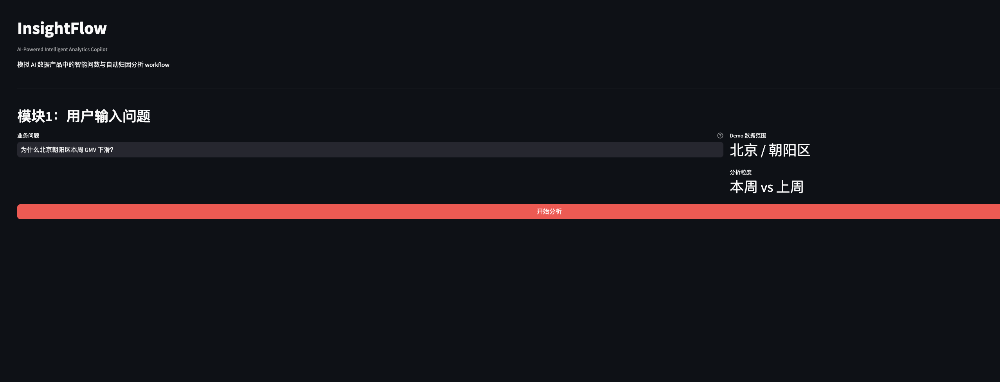

# AI Data Product Portfolio

这是一个 AI 数据产品方向的公开作品集，聚焦智能问数、NL2SQL、Prompt Engineering、评测体系和 AI 产品方案设计。

我做这个仓库的目标不是展示复杂算法工程，而是展示 AI 数据产品经理如何把业务问题拆解为 workflow，如何设计智能问数能力，如何通过 prompt benchmark 和 hallucination 指标验证 AI 功能是否具备上线基础。

## 项目列表

| 项目 | 状态 | 主题 | 展示能力 |
|---|---|---|---|
| 01 InsightFlow | Completed v1 | 智能问数与自动诊断 | AI workflow, NL2SQL, data analysis, TDD |
| 02 Prompt Eval Benchmark | Completed v1 | Prompt 调优与评测 | Prompt Engineering, Schema Grounding, Few-shot, hallucination control |
| 03 AI Product Case Study | Completed v1 | 产品方案设计 | PRD, AI product thinking, evaluation plan, guardrails |

## Featured Projects

### 01 InsightFlow

[InsightFlow](projects/01_insightflow_nl2sql) 是一个智能问数与自动诊断 demo。

用户输入中文业务问题：

```text
为什么北京朝阳区本周 GMV 下滑？
```

系统输出：

1. Intent Parsing：识别指标、城市、区域、任务类型和时间范围。
2. Generated SQL：把自然语言问题转成取数逻辑。
3. Analysis & Diagnosis：用 pandas 计算环比变化，并输出业务诊断。

当前测试状态：

```text
12 passed
```

项目截图：



### 02 Prompt Eval Benchmark

[Prompt Eval Benchmark](projects/02_prompt_eval_benchmark) 是一个面向智能问数场景的 Prompt Engineering 调优与评测项目。

它模拟未来 InsightFlow 接入真实 LLM 后，如何比较 Prompt V1、V2、V3 的解析效果：

1. V1：基础关键词 baseline。
2. V2：加入 Schema Grounding，降低字段和地区 hallucination。
3. V3：加入 Few-shot 示例，提升复杂 query、同义词和任务类型判断稳定性。

评测指标：

1. `metric_accuracy`
2. `district_accuracy`
3. `task_accuracy`
4. `overall_accuracy`
5. `hallucination_rate`

当前结果：

| Prompt Version | Overall Accuracy | Hallucination Rate |
|---|---:|---:|
| V1 | 0.182 | 0.773 |
| V2 | 0.636 | 0.000 |
| V3 | 1.000 | 0.000 |

这个结果来自 `evaluator.py` 实际生成的 `results.csv`。对应解读见：

```text
projects/02_prompt_eval_benchmark/results_summary.md
```

### 03 AI Product Case Study

[AI Product Case Study](projects/03_ai_product_case_study) 是一份面向中国互联网数据平台场景的 AI 数据产品方案。

它承接 Project 01 和 Project 02，进一步说明一个智能问数能力如何从 demo 进入产品化落地：

1. `prd.md`：定义用户、痛点、核心场景、AI workflow、MVP 范围和成功指标。
2. `evaluation_plan.md`：定义离线评测、在线评测、人工评审、prompt 版本迭代和上线门槛。
3. `rollout_plan.md`：定义 MVP、内测、灰度、全量和反馈闭环。
4. `risk_and_guardrails.md`：定义 hallucination、SQL、指标口径、权限和结果误读风险的防护机制。

这个项目重点展示 AI 数据产品经理如何定义能力边界：LLM 负责理解和组织，指标计算、SQL 校验、权限控制和口径治理必须由确定性系统完成。

## How To Run

运行 Project 01：

```bash
cd projects/01_insightflow_nl2sql
pip install -r requirements.txt
streamlit run app.py
pytest
```

运行 Project 02：

```bash
cd projects/02_prompt_eval_benchmark
pip install -r requirements.txt
python evaluator.py
pytest
```

阅读 Project 03：

```bash
cd projects/03_ai_product_case_study
```

## Portfolio Value

这个作品集关注 AI 数据产品从业务问题到系统评估的完整链路：

1. 用 InsightFlow 展示智能问数 workflow 如何从中文问题走到 SQL、分析和诊断。
2. 用 Prompt Eval Benchmark 展示 prompt 版本如何被评估，而不是凭感觉调优。
3. 用 hallucination rate 说明 AI 数据产品不能只看 accuracy，还要关注 schema 外输出对 SQL、分析和业务决策的风险。
4. 用 AI Product Case Study 补齐 PRD、上线门槛、灰度策略、人工审核机制和风险防护方案。

## Interview Narrative

这个作品集模拟的是 AI 数据产品经理在智能分析产品中的完整落地链路。Project 01 先做智能问数原型，把自然语言问题拆成 intent、SQL、数据计算和诊断；Project 02 进一步做 prompt evaluation，验证 schema grounding、few-shot 和 hallucination control 对稳定性的影响；Project 03 补齐产品方案能力，说明这个能力如何定义用户边界、上线门槛、灰度策略和风险防护。

Project 02 的评测结果只代表受控 benchmark 上的表现，不代表生产环境可以直接上线。下一步真实产品化需要继续扩展 adversarial query、多业务线、多时间范围、人工评审和线上反馈闭环。

面试讲法和后续优化路线见：

```text
docs/interview_strategy.md
```

## Repository Structure

```text
docs/        项目规划、数据策略和截图说明
skills/      可复用工作流说明
subagents/   子角色审查说明
hooks/       检查清单
projects/    具体作品集项目
```

## TDD

每个项目都遵循测试驱动开发：

1. 先写测试，明确输入和预期输出。
2. 再写最小实现。
3. 执行 `pytest` 验证。
4. 更新 README 和结果说明。

测试规范见：

```text
docs/testing_guide.md
```
