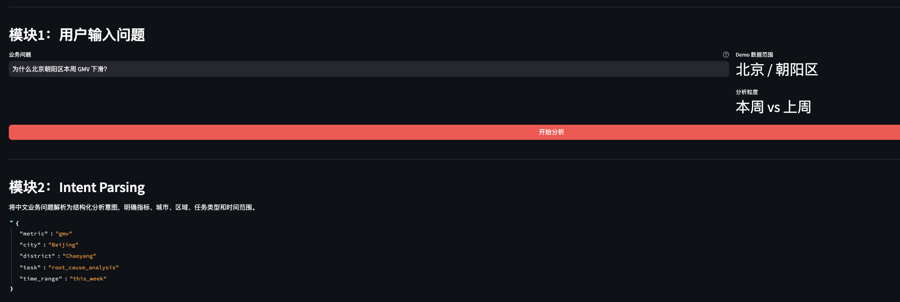
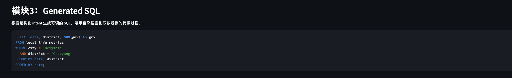
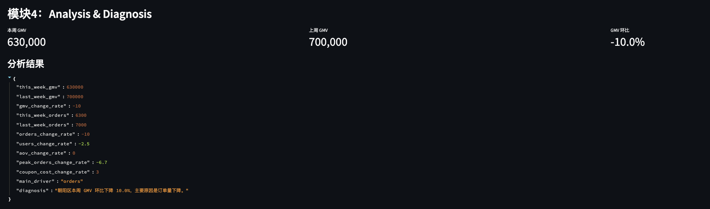
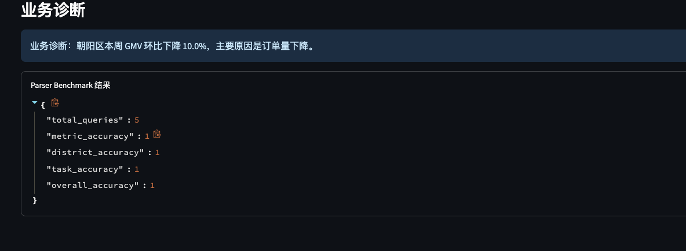

# InsightFlow

AI-Powered Intelligent Analytics Copilot

InsightFlow 是一个智能问数与自动归因分析 demo，模拟 AI 数据产品中“用户用自然语言提问，系统完成意图解析、SQL 生成、数据分析和业务诊断”的完整 workflow。

## 项目背景

在本地生活、外卖、零售等业务场景中，运营和业务负责人经常会问：

```text
为什么北京朝阳区本周 GMV 下滑？
```

传统流程通常需要分析师理解问题、确认指标口径、写 SQL、查数、做环比分析，再整理业务解释。InsightFlow 将这条链路拆成一个可运行的 AI 数据产品原型，用规则模拟 LLM 的语义理解和结构化生成，用 pandas 执行确定性计算。

## 用户痛点

1. 业务问题表达自然，但数据系统需要结构化查询条件。
2. 取数、写 SQL 和做归因分析依赖分析师，响应链路较长。
3. 业务解释容易混合主观判断，缺少可复现的计算过程。
4. AI 生成答案如果没有评测和边界控制，容易产生幻觉或过度解释。

## AI Workflow

```text
用户输入中文问题
        ↓
Intent Parsing：解析指标、地区、任务和时间范围
        ↓
Generated SQL：生成取数 SQL
        ↓
Analysis：用 pandas 计算本周、上周和环比变化
        ↓
Diagnosis：输出可解释的业务诊断
        ↓
Evaluation：用 benchmark 评估 parser 准确率
```

这个 workflow 的核心原则是：AI 负责理解和组织，数据计算由确定性模块完成。

## 核心能力

| 能力 | 当前实现 | 展示价值 |
|---|---|---|
| 智能问数 | 解析中文业务问题 | 展示自然语言到结构化 intent 的转换 |
| NL2SQL | 根据 intent 生成 SQL | 展示从业务问题到取数逻辑的映射 |
| 自动归因 | 计算 GMV、订单、用户、客单价等变化 | 展示指标拆解和主因判断 |
| Prompt Evaluation | 使用 benchmark 评估 parser 输出 | 展示评测闭环和迭代思维 |
| TDD | 使用 pytest 覆盖核心模块 | 展示每轮迭代可验证 |
| Mock Data | 支持小样本和扩展日粒度数据 | 展示可控业务场景构造能力 |

## 技术架构

```text
app.py                 Streamlit 页面入口
parser.py              中文 query 解析
sql_generator.py       SQL 生成
analytics.py           pandas 数据分析和诊断
evaluator.py           parser benchmark 评测
data_generator.py      生成扩展 mock 数据
mock_data.csv          小型演示数据
mock_data_extended.csv 日粒度扩展数据
benchmark_queries.csv  评测问题集
tests/                 pytest 单元测试
```

技术栈：

1. Python
2. pandas
3. Streamlit
4. pytest

## Demo 示例

默认问题：

```text
为什么北京朝阳区本周 GMV 下滑？
```

解析结果：

```python
{
    "metric": "gmv",
    "city": "Beijing",
    "district": "Chaoyang",
    "task": "root_cause_analysis",
    "time_range": "this_week"
}
```

生成 SQL：

```sql
SELECT date, district, SUM(gmv) AS gmv
FROM local_life_metrics
WHERE city = 'Beijing'
  AND district = 'Chaoyang'
GROUP BY date, district
ORDER BY date;
```

诊断输出：

```text
业务诊断：朝阳区本周 GMV 环比下降 10.0%，主要原因是订单量下降。
```

## Demo 截图

首页完整界面：


Intent Parsing 输出：



Generated SQL 输出：



Analysis & Diagnosis 输出：



Benchmark / 测试结果：



## 如何运行

安装依赖：

```bash
cd projects/01_insightflow_nl2sql
pip install -r requirements.txt
```

启动 demo：

```bash
streamlit run app.py
```

运行测试：

```bash
pytest
```

生成扩展 mock 数据：

```bash
python data_generator.py
```

## Prompt Evaluation

当前版本用规则模拟 prompt / parser 输出，并通过 `benchmark_queries.csv` 做基础评测。

评测指标：

1. Metric Accuracy：指标识别准确率
2. District Accuracy：区域识别准确率
3. Task Accuracy：任务类型识别准确率
4. Overall Accuracy：整体解析准确率

运行方式：

```bash
python evaluator.py
```

当前评测结果可以在 Streamlit 页面中的 `Parser Benchmark 结果` 展开查看。

## 面试讲法

这个项目可以从三个角度介绍：

1. 产品角度：InsightFlow 解决的是业务人员自然语言问数和经营异动诊断的问题，核心价值是缩短从问题到分析结论的链路。
2. Workflow 角度：项目把智能问数拆成 intent parsing、SQL generation、data analysis、business diagnosis 和 evaluation，避免把所有能力都交给模型黑盒完成。
3. 评测角度：项目用 benchmark 和 pytest 验证 parser、SQL、分析和主流程，体现 AI 数据产品不仅要能生成答案，也要能评估答案质量。

AI 能力边界：

1. 当前 demo 不调用真实大模型，用规则模拟 LLM workflow。
2. SQL 生成用于展示取数逻辑，不直接连接真实数据库。
3. 业务诊断只基于 mock 数据中的指标变化，不做超出数据证据的因果推断。
4. 后续接入真实 LLM 时，应保留 SQL 校验、答案校验和人工审核机制。
