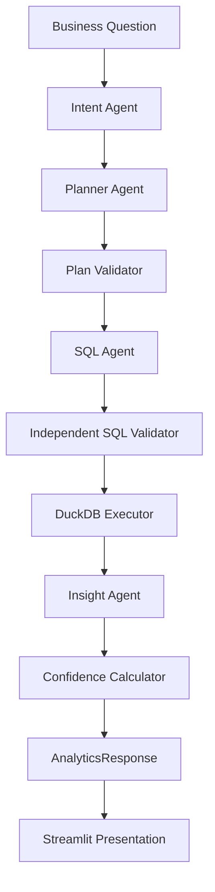

# Text2Analytics: An Evidence-based Analytics System for Decision Support

Text2Analytics 是一个确定性、可复现的研究型作品集 MVP。它展示的重点不是“AI 能写出一条 SQL”，而是如何把一个业务问题转换为可检查的分析计划、安全查询、数据事实、谨慎解释、不确定性说明和证据完整度评分。

当前版本聚焦一个受控黄金问题：

```text
为什么北京朝阳区本周 GMV 下滑？
```

项目不接入 LLM 或复杂 Agent 框架。第一阶段使用确定性模块验证产品链路、证据边界和评测方法，为后续研究与迭代建立可复现基线。

## Why Text2SQL Is Not Enough

Text2SQL 只回答“如何取数”，但业务决策还需要回答更多问题：

1. 用户真正想做哪类分析？
2. 一个结论需要经过哪些分析步骤？
3. SQL 是否只使用已知表和字段，是否安全可执行？
4. 查询结果中哪些内容是事实，哪些只是解释？
5. 当前数据不能支持哪些判断？
6. 结论的证据链是否完整？

如果系统只生成 SQL，再直接输出自然语言结论，就容易隐藏错误路径、混淆事实与解释，并把相关性描述成因果关系。Text2Analytics 将这些环节拆开，使每一步都能被检查和测试。

## Project Motivation

传统业务分析通常由分析师完成问题澄清、指标确认、SQL 编写、数据验证、指标拆解和结论表达。自然语言分析系统可以缩短这条链路，但只有在以下条件成立时才适合辅助决策：

- 分析路径可见，而不是直接跳到答案；
- SQL 基于真实 Schema，并经过独立安全校验；
- 结论能够追溯到查询结果；
- 系统主动表达数据缺口和因果边界；
- 质量可以通过结构化 Evaluation 复现。

这个项目尝试把这些原则做成一个低成本、可运行的产品原型，而不是声称已经解决任意业务分析问题。

## Research Framing

本项目以探索性研究原型为定位，而不是以生产级能力或开放域泛化为目标。它：

- **explores** 如何把自然语言业务问题拆解为可检查的分析步骤；
- **investigates** 结构化中间表示如何支持 Schema Grounding、证据绑定和不确定性表达；
- **provides a controlled environment for studying** 分析链路在固定 GMV 下滑场景中的行为。

因此，它更准确的定位是一个 **controlled analytical reasoning system prototype**，以及一个 **single-domain constrained evaluation setup**。

### Not a Solution Claim

This project does not claim to solve general-purpose business analytics or automated reasoning in open environments. It is a constrained experimental system designed to study structured analytical decomposition under controlled conditions.

核心研究问题是：

> **How can we structure LLM-assisted analytics into verifiable, evidence-grounded reasoning steps?**

### Research Question Refinement

This work does not answer the question of whether LLMs can reliably perform analytics in open domains. Instead, it studies how structured intermediate representations (Intent, Plan, Fact, Limitation) behave in a controlled pipeline.

当前版本有意使用确定性规则，而不是直接接入真实 LLM。它提供一个受控环境，用于研究哪些中间状态需要结构化、哪些失败必须中止、哪些解释必须绑定证据，以及系统如何表达无法判断的部分。这一设置可以作为后续研究概率性 LLM 行为的可复现比较基线，但不能代表真实 LLM 在开放输入下的表现。

## What This Project Is NOT

- **Not a production analytics system**：不主张具备生产级吞吐、稳定性、权限治理或运维能力。
- **Not a general LLM agent framework**：不提供通用 Agent 编排、工具生态或自主任务执行能力。
- **Not an open-domain reasoning system**：不主张能够处理任意领域、任意数据或任意分析问题。
- **Not a benchmarking framework for real-world performance**：当前评测不衡量真实环境中的性能、泛化或用户价值。

## System Architecture



核心链路：

```text
AnalyticsRequest
-> IntentResult
-> AnalysisPlan
-> PlanValidationResult
-> GeneratedQuery
-> SQLValidationResult
-> QueryExecutionResult
-> InsightResult
-> ConfidenceAssessment
-> AnalyticsResponse
```

`pipeline.py` 只负责编排、保存阶段产物和失败中止。指标计算、SQL 安全、Insight 生成和 Confidence 规则分别保留在对应模块中。`app.py` 只消费 `AnalyticsResponse`，不重复实现分析逻辑。

## Golden Use Case

黄金问题使用数据最大日期向前 7 天作为本周，再向前连续 7 天作为上周。

真实 DuckDB 查询结果：

| 指标 | 本周 | 上周 | 环比 |
|---|---:|---:|---:|
| GMV | 680,309 | 751,318 | -9.5% |
| 订单量 | 6,776 | 7,481 | -9.4% |
| 活跃用户 | 6,174 | 6,133 | +0.7% |
| 客单价 | 100.40 | 100.43 | 0.0% |
| 高峰订单 | 2,096 | 2,316 | -9.5% |
| 优惠券成本 | 68,027 | 75,128 | -9.5% |

系统给出的谨慎解释是：

> 订单量下降与 GMV 下滑方向一致，是当前数据中最显著的关联因素。

这句话描述的是观测指标之间的关系，不是因果结论。

## Type-safe Pipeline

所有跨模块业务数据都使用 Pydantic Schema，包括：

- `AnalyticsRequest`
- `IntentResult`
- `AnalysisPlan`
- `GeneratedQuery` / `ValidatedQuery`
- `QueryExecutionResult`
- `Fact` / `Interpretation` / `Limitation`
- `ConfidenceAssessment`
- `PipelineError` / `AnalyticsResponse`
- `EvaluationReport`

类型化边界避免模块之间传递散乱字典，也让单元测试可以独立构造任意阶段的输入。失败响应统一包含 `failed_stage`、`error_code` 和 `message`；失败时不生成虚假 Confidence。

## Schema Grounding and SQL Guardrails

SQL Agent 只能使用 `schema_catalog.py` 暴露的三张表：

- `fact_orders`
- `dim_district`
- `fact_marketing_cost`

候选 SQL 不能直接执行，必须先经过独立 `sql_validator.py`。当前 Guardrails 会拒绝：

- 未知表；
- 未知字段；
- `DELETE` 等非只读语句；
- 多语句输入；
- `SELECT *`；
- 未通过 AST 和 Schema 白名单检查的查询。

Executor 只接受 `ValidatedQuery`，然后在本地 DuckDB 中执行真实 CSV 查询。任一必需 SQL 校验失败时，所有查询都不会执行；任一必需查询失败或为空时，系统不会继续生成 Insight。

## Fact / Interpretation / Limitation

Insight 输出被明确分成三层：

### Fact

Fact 只描述查询结果直接支持的数值，并保留 `fact_id`、指标、单位、当前值、对比值、变化率和来源步骤。

### Interpretation

Interpretation 必须引用有效 `fact_id`，并标记 reasoning type：

- `comparison`
- `decomposition`
- `correlation`

Pydantic 契约会拒绝“导致”“证明”“必然因为”“根本原因是”等因果措辞。

### Limitation

当前输出明确说明：

1. 当前数据只能支持相关性分析，不能证明因果关系。
2. 缺少库存、天气、竞品、营销曝光等外部解释变量。
3. 优惠券成本只能说明已观测投入变化，不能单独说明营销效果。

## Confidence as Evidence Completeness

Confidence 表示 evidence completeness，不表示结论为真的概率。

黄金链路当前得分为 `0.90`。评分依据同时展示给用户：

- Intent 是否完整；
- Plan 是否覆盖三条必需路径；
- SQL 是否全部校验并执行成功；
- 当前期和对比期是否完整；
- Interpretation 是否绑定 Fact；
- 是否缺少支持数据；
- 是否足以完成指标拆解；
- 是否存在只能观察相关性的重要限制。

页面不会只展示一个孤立分数，而会同时展示每个 factor 的 `name`、`impact` 和 `reason`。

## Evaluation Framework

当前评测是一次 **controlled deterministic evaluation**，包含 10 个案例：

- 4 个黄金问题等价表达；
- 2 个模糊问题；
- 2 个超范围问题；
- 2 个对抗问题。

它主要验证：黄金链路、失败中止、SQL guardrails、evidence grounding 和 uncertainty display。

**This evaluation is not performance benchmarking. It is structural validity verification. Results are only valid under the constrained dataset and deterministic logic used in this prototype.**

| Dimension | Pass Rate |
|---|---:|
| intent_correctness | 100% |
| plan_coverage | 100% |
| sql_groundedness | 100% |
| sql_executability | 100% |
| insight_groundedness | 100% |
| uncertainty_clarity | 100% |

这些结果只表示受控设定中的 **validity under constrained scenario**：在固定数据集、单一领域、预先定义的问题边界和确定性逻辑下，结构化链路能够按预期串联或中止。该 Evaluation 是 structural validity verification，而不是 performance benchmarking；它是 controlled deterministic evaluation 的一致性结果，**not a generalization metric**，不能用于推断系统面对任意业务问题、真实用户表达或新数据集时的表现。换言之，100% 通过率不代表系统可以泛化到任意业务问题；当前评测仍只覆盖一个黄金场景和少量等价表达。

完整产物：

- `evaluation_results.json`：每个案例、每个维度的 pass、score 和 details；
- `evaluation_summary.md`：案例结果、维度通过率和失败原因摘要。

未来扩展需要更多数据集、更宽的问题类型和更真实的用户评测。

### Threats to Validity

- **Single dataset limitation**：当前结论与评测均来自一套受控本地模拟数据，无法说明在其他数据质量、Schema 或分布下仍然成立。
- **Single domain (GMV drop)**：系统只覆盖 GMV 下滑分析及少量等价表达，无法代表趋势、漏斗、留存、预测等其他分析任务。
- **Deterministic rules vs real LLM behavior**：确定性规则能够提供可复现基线，但不会复现真实 LLM 的语言理解偏差、随机性、幻觉和提示敏感性。
- **No user interaction study**：项目尚未通过真实业务用户或分析师研究验证可理解性、信任校准、任务效率或决策质量。
- **No production workload evaluation**：当前未评估生产级数据规模、并发、延迟、成本、权限、查询资源限制或长期运行稳定性。

## Limitations

1. 当前只覆盖北京朝阳区本周 GMV 下滑这一个黄金场景及少量等价表达。
2. Intent、Plan、SQL 和 Insight 使用确定性规则，不代表开放问题理解能力。
3. 数据为受控的本地模拟经营数据，不能代表真实生产数据分布。
4. SQL Validator 尚未提供生产级权限、资源限制和查询成本控制。
5. Evaluation 只有 10 个受控案例，尚未覆盖噪声输入、复杂追问和真实用户行为。
6. 当前结论只能支持相关性分析和指标拆解，不能识别业务因果关系。
7. Streamlit 页面是展示型原型，没有登录、多数据源、远程 API 或协作功能。

## Research Contribution

这里的 contribution 指作品集原型对研究问题的工程化表达，不声称构成新的学术理论或已经完成论文验证。项目重点展示三个可复用的研究设计点：

1. **Evidence decomposition**：把分析输出拆成 Fact、Interpretation 和 Limitation，并要求 Interpretation 显式引用 Fact，使“数据观察”与“分析解释”不再混为一体。
2. **Uncertainty representation**：用 Limitation 表达缺失变量、相关性边界和无法判断的部分，同时将 Confidence 定义为 evidence completeness，而非答案真实概率。
3. **Pipeline-level verification**：在 Intent、Plan、SQL Validation、Execution、Insight 和 Confidence 层保留结构化中间状态，通过类型校验、失败中止和多维 Evaluation 检查整条推理链，而不只检查最终答案是否流畅。

这三个点共同支持一个更谨慎的分析系统观：系统价值不仅来自生成结果，也来自让证据、推理过程和边界能够被人检查。

## Research Relevance

这是一个研究型作品集项目，而不是已经完成的论文。它提供了几个可以继续研究和讨论的方向：

- **human-centered AI**：让用户看到系统如何理解问题、如何规划分析，以及在哪一步失败；
- **explainable analytics**：把查询事实、分析解释和限制说明分开呈现；
- **decision support**：用可追溯证据辅助判断，而不是替用户做未经验证的决策；
- **human-AI collaboration**：将系统定位为可检查的分析协作者，而不是不可质疑的答案生成器；
- **uncertainty communication**：主动表达相关性边界、缺失变量和证据完整度。

后续工作可以基于更多业务问题、真实用户任务和人工评审，研究这种结构化证据呈现是否真正改善分析效率、理解程度和决策质量。

## Future Research

以下方向是待研究的问题，不是当前原型已经具备的能力：

- **Extension to multi-domain datasets**：在不同业务领域、Schema 和数据分布中检验结构化中间表示是否仍然有效。
- **Integration with probabilistic LLM behavior**：引入具有随机性、语言理解偏差和幻觉风险的真实 LLM，比较其与确定性基线的差异。
- **Human evaluation studies**：通过分析师和业务用户研究，评估可理解性、信任校准、任务效率及决策支持价值。
- **Uncertainty calibration experiments**：研究 evidence completeness、人工判断与实际错误之间的关系，并探索更可靠的不确定性表达和校准方法。

## Reproducibility

进入项目目录：

```bash
cd projects/01_insightflow_nl2sql
```

安装依赖：

```bash
python -m pip install -r requirements.txt
```

启动 Streamlit：

```bash
streamlit run app.py
```

运行项目全量测试：

```bash
pytest -q
```

重新生成 Evaluation 报告：

```bash
python evaluation.py
```

当前核心技术栈：Python、Pydantic 2、DuckDB、sqlglot、pandas、Streamlit 和 pytest。
